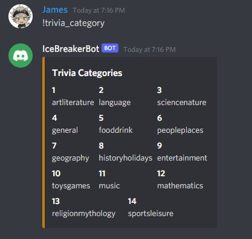
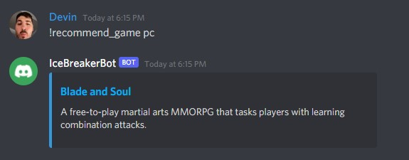
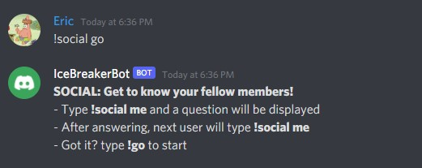

<div id="top"></div>

# StormHacks 2022: Icebreaker Bot

A discord bot created for StormHacks 2022. For more information about the event, please visit [StormHacks's](https://stormhacks.com/) website.

<!-- TABLE OF CONTENTS -->
<summary>Table of Contents</summary>
<ol>
  <li>
    <a href="#about-the-project">About The Project</a>
    <ul>
      <li><a href="#team">Team</a></li>
      <li><a href="#built-with">Tech Stack</a></li>
    </ul>
  </li>
  <li>
    <a href="#getting-started">Getting Started</a>
    <ul>
      <li><a href="#prerequisites">Prerequisites</a></li>
      <li><a href="#installation">Installation</a></li>
    </ul>
  </li>
</ol>

## About The Project

<br>

<div align="center">
  
  
  
</div>
<p align="right">(<a href="#top">back to top</a>)</p>

## Team

- [Devin Lu](https://www.linkedin.com/in/devinllu/), SFU, 4th Year Student
- [Eric Reyes](https://www.linkedin.com/in/erreyess/), SFU, 4th Year Student
- [James Tariga](https://www.linkedin.com/in/james-tariga/), KPU, 4th Year Student

## Tech Stack

- Python
- Discord API
- [FreeToGameAPI](https://www.freetogame.com/api-doc)

<p align="right">(<a href="#top">back to top</a>)</p>

## Getting Started

This project requires python and pip, make sure to have python installed before running the project locally.

## Prerequisites

Check if Python version 3 is installed.

```
python --version
```

## Installation

1. Get free API key at [API NINJAS](https://api-ninjas.com/), but to get the .env file, email one of the creators.
2. Clone the repo
   ```
   git clone git@github.com:devinllu/StormHacks2022.git
   ```
3. Setup the virtual environment
   ```
   pip install virtualenv
   virtualenv venv
   source venv/bin/activate
   pip install -r requirements.txt
   ```
4. Run the app
  ```
  python main.py
  ```

## Questions
For any other questions/inquiries, please contact the creators by email.